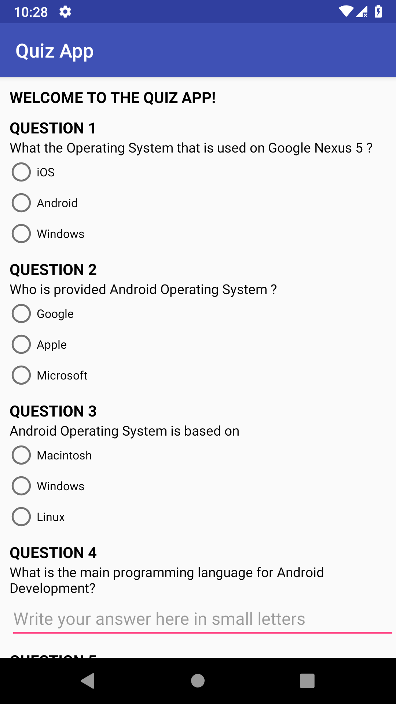

## Project 3: [Quiz App](https://github.com/akueisara/android-basics-nanodegree-by-google/tree/master/QuizApp)
### Design and implement a short quiz app about some topic you are familiar with.
The app implements a 5-question Android quiz.

